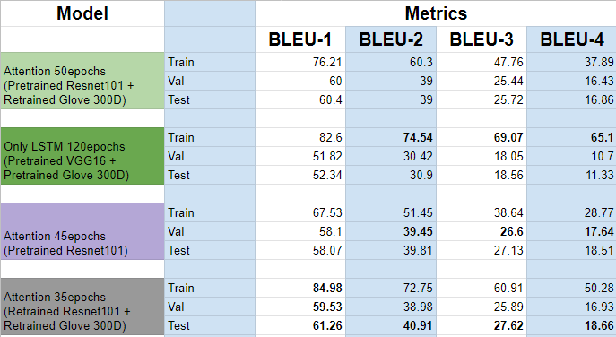

# Image-Captioning-PyTorch
This repo contains codes to preprocess, train and evaluate sequence models on Flickr8k Image dataset in pytorch. This repo was a part of a Deep Learning Project for the Machine Learning Sessional course of Department of CSE, BUET for the session January-2020.

**Models Experimented with**:
- Pretrained CNN encoder & LSTM based Decoder
    - VGG-16, Inception-v3, Resnet-50, Resnet-101, Resnext-101, Densenet-201
- Pretrained Resnet-101 & LSTM with Attention Mechanism

Open [`Pretrained Attention Model's Notebook`](demo_attention_flickr8k.ipynb) or [`Pretrained MonoLSTM Model's Notebook`](demo_monolstm_flickr8k.ipynb) in colab and execute from top to bottom.  

**Pre-requisites**:
 - Datasets:
    - Flickr8k Dataset: [images](https://github.com/jbrownlee/Datasets/releases/download/Flickr8k/Flickr8k_Dataset.zip) and [annotations](https://github.com/jbrownlee/Datasets/releases/download/Flickr8k/Flickr8k_text.zip)
 - Pre-trained word embeddings:
    - [Glove Embeddings of 6B words](http://nlp.stanford.edu/data/glove.6B.zip)

**Data Folder Structure for training using [`train_torch.py`](train_torch.py) or [`train_attntn.py`](train_attntn.py):**
```
data/
    flickr8k/
        Flicker8k_Dataset/
            *.jpg
        Flickr8k_text/
            Flickr8k.token.txt
            Flickr_8k.devImages.txt
            Flickr_8k.testImages.txt
            Flickr_8k.trainImages.txt
    glove.6B/
        glove.6B.50d.txt
        glove.6B.100d.txt
        glove.6B.200d.txt
        glove.6B.300d.txt
```

**Bleu score comparision of trained models**:

